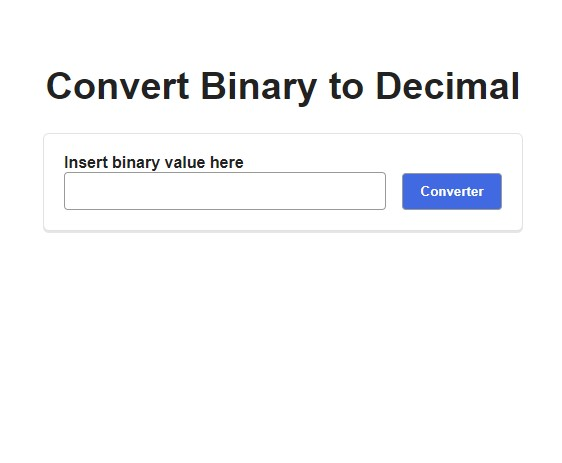
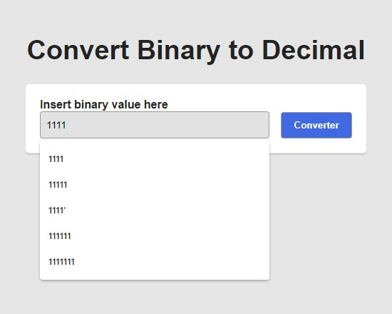
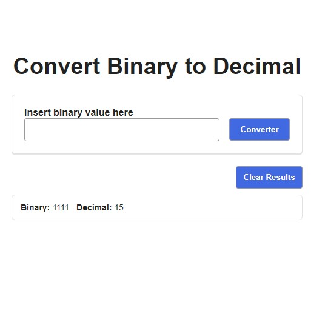

# app-ideas-challenge-bin2Dec

This repository aims to solve the following challenge

Link to Challenge: [https://github.com/florinpop17/app-ideas/blob/master/Projects/1-Beginner/Bin2Dec-App.md]

# Images

## initial state

## insert binary value

## show result binary value on decimal

